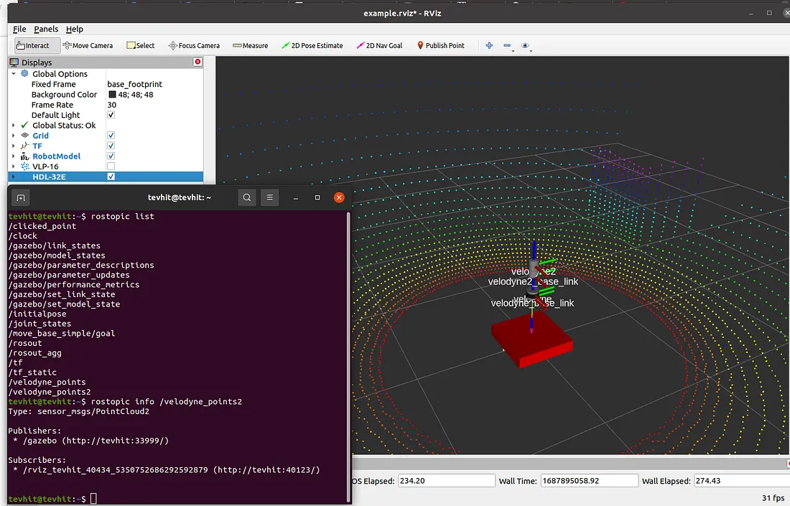
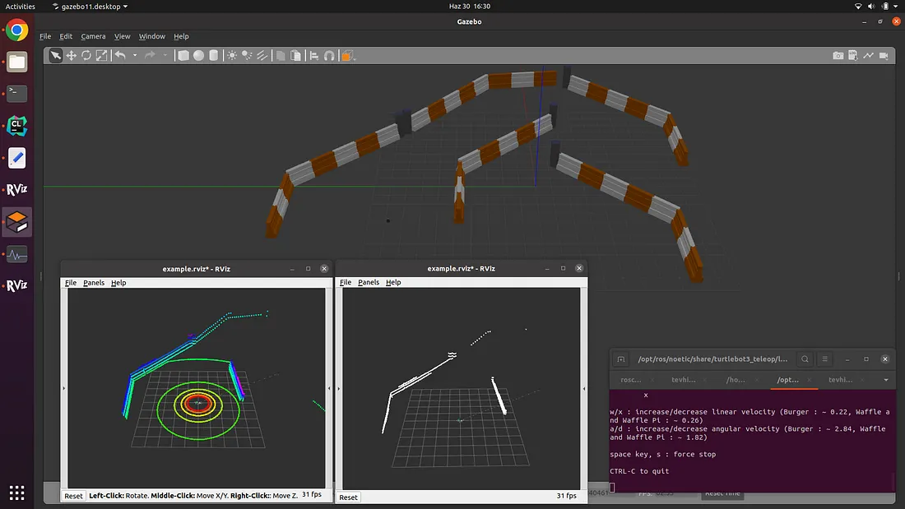

# pcl_velodyne_ws

### Set up
```bash
cd .devcontainer
docker copose up -d
```

### Simple Example
```bash
catkin_make
source devel/setup.bash
roslaunch velodyne_description example.launch
```


### Control Turtlebot
```bash
source devel/setup.bash
export TURTLEBOT3_MODEL=burger
roslaunch turtlebot3_velodyne_gazebo progressive_morphological_filter.launch
```

Open a new terminal, then
```bash
source devel/setup.bash
export TURTLEBOT3_MODEL=burger
rosrun progressive_morphological_filter ProgressiveMorphologicalFilter
```

For controlling the Turtlebot3 robot, open a new terminal at the same path and then
```bash
source devel/setup.bash
roslaunch turtlebot3_teleop turtlebot3_teleop_key.launch
```


### References
[Working with Point Cloud Library in ROS & Gazebo [PCL Part 1]](https://medium.com/@tevhitkarsli/working-with-point-cloud-library-in-ros-gazebo-pcl-1-70ba44beb443)